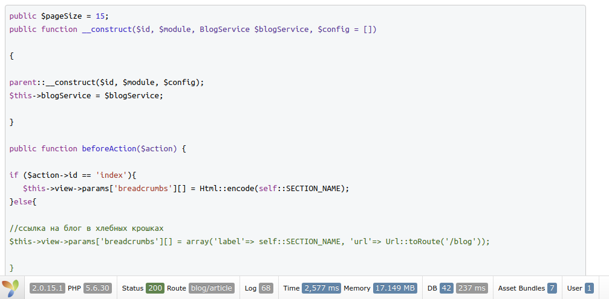

Syntax highlighter widget for Yii2
==================================
This widget is for the yii2 framework. This is a wrapper for the javascript plugin Highlight.js.

If you post the code as part of the content on the website, then with this widget your code will look stylish.

In the pictures below you can see examples of how the code will look on the website pages.




***********

Installation
------------

The preferred way to install this extension is through [composer](http://getcomposer.org/download/).

Either run

```
php composer.phar require --prefer-dist coderius/yii2-highlight-js "*"
```

or add

```
"coderius/yii2-highlight-js": "*"
```

to the require section of your `composer.json` file.


Usage
-----

Once the extension is installed, simply use it in your code by  :

```php
<?php coderius\yii2_highlight_js\HighlightWidget::begin();?>

<?= $content ?>

<?php coderius\yii2_highlight_js\HighlightWidget::end(); ?>
```


Some code that needs to be formalized with the plugin must be framed in the block :

```html
<pre>
...some code
</pre>
```


If You need to change the styles of the code block, you can attach your styles in this way.

```php
<?php coderius\yii2_highlight_js\HighlightWidget::begin(
            [
                'customAsset' => \coderius\yii2_highlight_js\CustomExampleAsset::register($this),

            ]
        ); 
?>

<?= $content ?>

<?php coderius\yii2_highlight_js\HighlightWidget::end(); ?>
```

In this example I did my custom asset (as example codev\yii2_highlight_js\NumLineAsset::className())
It contains paths to styles and scripts to change the style HighlightWidget.


Advensed example:

```php

<?php HighlightWidget::begin([
    'theme' => 'Xcode',
    'customAsset' => \coderius\yii2_highlight_js\CustomExampleAsset::register($this),
    'css' => "pre{font-style: italic;}"//any string style css 
    'js' => "alert('ok');",
    'positionJs' => yii\web\View::POS_END,//default value is yii\web\View::POS_READY
]); ?>


    <?= $article->text; ?>


           
<?php HighlightWidget::end(); ?>

```
In this example I set theme name as "Xcode". But default theme is "Default"


Themes list:
------------
* Default
* Agate
* Androidstudio
* Arduino Light
* Arta
* Ascetic
* Atelier Cave Dark
* Atelier Cave Light
* Atelier Dune Dark
* Atelier Dune Light
* Atelier Estuary Dark
* Atelier Estuary Light
* Atelier Forest Dark
* Atelier Forest Light
* Atelier Heath Dark
* Atelier Heath Light
* Atelier Lakeside Dark
* Atelier Lakeside Light
* Atelier Plateau Dark
* Atelier Plateau Light
* Atelier Savanna Dark
* Atelier Savanna Light
* Atelier Seaside Dark
* Atelier Seaside Light
* Atelier Sulphurpool Dark
* Atelier Sulphurpool Light
* Atom One Dark
* Atom One Light
* Brown Paper
* Codepen Embed
* Color Brewer
* Darcula
* Dark
* Darkula
* Docco
* Dracula
* Far
* Foundation
* Github Gist
* Github
* Googlecode
* Grayscale
* Gruvbox Dark
* Gruvbox Light
* Hopscotch
* Hybrid
* Idea
* Ir Black
* Kimbie Dark
* Kimbie Light
* Magula
* Mono Blue
* Monokai Sublime
* Monokai
* Obsidian
* Ocean
* Paraiso Dark
* Paraiso Light
* Pojoaque
* Purebasic
* Qtcreator Dark
* Qtcreator Light
* Railscasts
* Rainbow
* Routeros
* School Book
* Solarized Dark
* Solarized Light
* Sunburst
* Tomorrow Night Blue
* Tomorrow Night Bright
* Tomorrow Night Eighties
* Tomorrow Night
* Tomorrow
* Vs
* Vs 2015
* Xcode
* Xt 256
* Zenburn


License
-------
yii2_highlight_js is released under the BSD License. See LICENSE.md file for details.

This yii2 extantion widget is a wrapper over a plugin highlight_js https://github.com/isagalaev/highlight.js